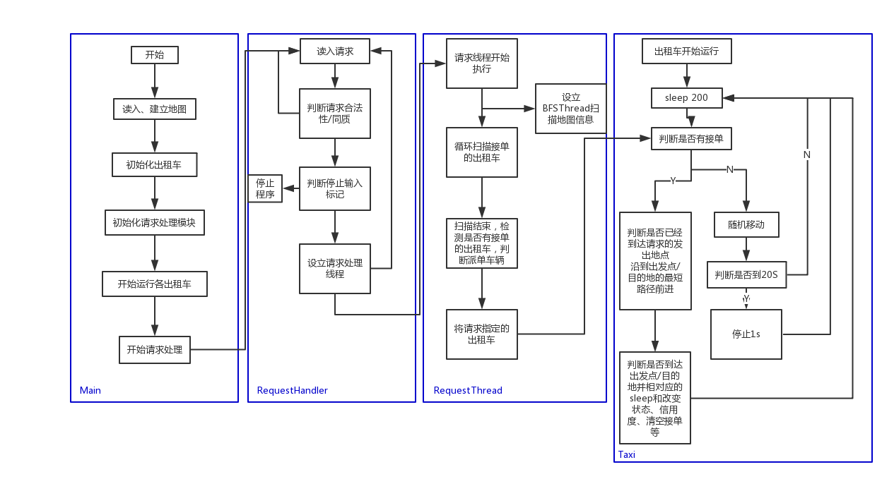

# 需求分析文档

## 出租车调度

## 系统简述

### 系统功能描述

1. 读进所需要的地图，判断其连通性，判断其任意两点间的最短距离
2. 设立100辆出租车对应的线程，在没有制定请求时随机移动，一旦被分派了请求，分别完成沿当前位置到目标位置的最短路径行走的接客和送客的功能，并具有信用度的累计和四种状态的转换
3. 从控制台读入指令，判断其合法性和是否同质，然后利用信息生成对应的指令线程，在指令线程中不断扫描符合要求的出租车，在时间窗口关闭时进行派单

### 系统性能要求

出租车每次运动一条边的时间为200ms，相对应的就是每次进行一次运动之后sleep 200ms，因此需要使获得随机运动方向和获得最短路线的时间尽可能短

进行一次单点BFS搜索获得图中所有点到一个指定点的距离所需要的实践大约稍高于100ms，如果在沿最短路径行走时，每次都要获取当前点到目的地的距离、周围四个点到目的地的距离时重复BFS操作，所需时间过长，导致实际每条边运行时间远高于200ms，因此需要一些办法来解决

### 约束条件

#### 输入

1. 地图必须是连通图，且输入格式满足作业指导书要求
2. 输入的乘客请求必须满足`readme` 规定的格式，此外还需要同质判断等功能

#### 输出

输出的目标包括控制台、`summary.txt`，`detail.txt`，详细信息参见`readme`

### 数据 测试

详细要求参见`readme`

## 交互分析

#### 本次实现的出租车调度系统需要以下几个对象之间进行交互：

1. 乘客请求：发出请求，请求将被系统内开发的请求处理`RequestHandler`所捕获，然后针对每一个被捕获的请求，设立其对应的请求线程用于实际执行该指令
2. 请求线程：用于实际执行该指令，被请求处理模块建立，扫描指令发出地周围的出租车信息，判断那些出租车可以接单，那辆出租车最后将被派单；在该线程中，也将建立新的线程`BFSThread`用于获得图中各点到出发点和目的地点之间的距离信息
3. 地图：用于存储输入的地图信息和获取距离信息、判断连通等地图操作
4. 出租车：在没有被派单时随机移动，在被请求线程派单后，每次通过地图获得下一步运行的方向，知道到达目的地转入随机运动为止

#### 因此，系统中主要包括以下四个主要的类：

1. `RequestHandler`：处理输入请求，判断请求合法性，开始请求的执行
2. `RequestThread`：每个请求的实际执行者
3. `Map`：管理地图信息，进行地图操作
4. `Taxi`：出租车

#### 类图和主要的执行流程

### 并发

1. 各辆出租车的运行是单独的线程
2. 各个请求也是单独的线程

出租车之间没有直接的交互，各辆出租车都需要读取`Map`类的内容，但是不会有写入操作

请求线程之间也没有直接的交互，但是会间接通过出租车进行交互，可能会导致冲突，因此相应的地方进行了加锁